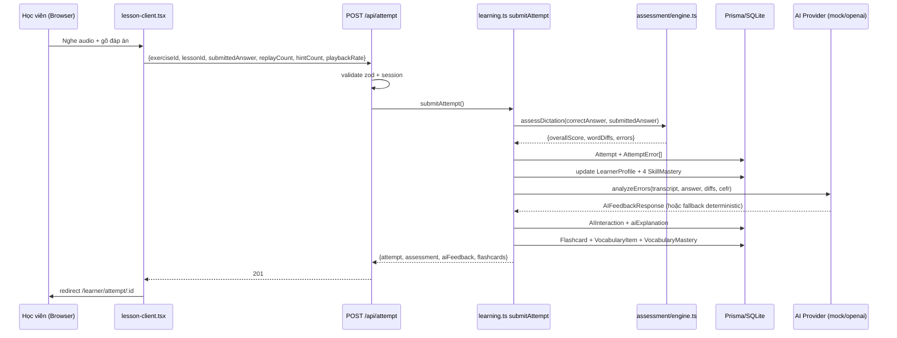
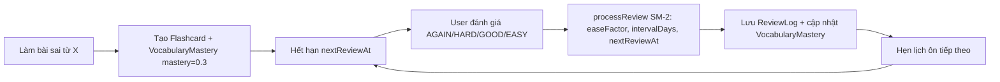

# 📋 BÁO CÁO TỔNG QUAN DỰ ÁN — LISTENAI

> **Ngày kiểm tra:** 2026-08-17
> **Phạm vi:** Toàn bộ codebase `e:\app-hoc-tieng-anh`
> **Tài liệu này dành cho:** Con người (dev, PM) lẫn A.I (agent coding) — được viết theo chuẩn dễ phân tích
> **Trạng thái tổng thể:** 🟢 **Build & Type-check PASS** | 🟡 **Lint có ~20 lỗi** | 🔴 **Chưa có test** | 🟡 **Bug tiềm ẩn & bảo mật cần xử lý**

---

## Cập nhật tiến độ và xác thực — 2026-09-01

- **TTS:** Code hiện có hai đường dẫn: tiếng Anh ưu tiên Web Speech ở chế độ nhanh hoặc Kokoro ở chế độ chất lượng cao, có fallback; tiếng Việt dùng VieNeu sidecar. `VoiceQualityToggle` lưu lựa chọn `fast`/`high` ở local storage.
- **Game Hub:** `/learner/games` có các chế độ chơi theo vocabulary và gửi kết quả qua `POST /api/game-session`; route xác thực session, kiểm tra payload và cập nhật mastery trong transaction.
- **Health check:** `GET /api/health` hiện tồn tại và trả JSON `status: "ok"` cùng timestamp, phù hợp với `healthCheckPath` trong `render.yaml`.
- **Xác thực ngày này:** `npm run type-check` **PASS** (`tsc --noEmit`). Chưa chạy test, lint hoặc build theo phạm vi cập nhật này.
- **Trạng thái test/lint/build hiện biết:** Codebase hiện có các unit test Vitest trong `src/**`, nhưng chưa được chạy trong lần kiểm tra này. Artifact `lint_current.json` ghi nhận 0 lỗi và 40 cảnh báo; lint chưa được chạy trong lần kiểm tra này. Build chưa được chạy trong lần kiểm tra này; kết quả build PASS trong phần cũ là kết quả của ngày 2026-08-17, không phải xác nhận mới.
- **Còn cần cho deployment:** commit và xác minh các Prisma migrations trong working tree trước khi dùng `prisma migrate deploy`; cấu hình đầy đủ biến môi trường production, database PostgreSQL, `NEXTAUTH_SECRET`, và dịch vụ VieNeu nếu cần TTS tiếng Việt. Cần chạy lại build/deployment smoke check trước khi phát hành.

> Các mục trong phần này mô tả working tree hiện tại và không khẳng định đã hoàn tất migration, E2E, hardening bảo mật hoặc deployment production.

---

## MỤC LỤC

1. [Tóm tắt dự án](#1-tóm-tắt-dự-án)
2. [Công nghệ & phiên bản](#2-công-nghệ--phiên-bản)
3. [Cấu trúc thư mục](#3-cấu-trúc-thư-mục)
4. [Mô hình dữ liệu (Prisma)](#4-mô-hình-dữ-liệu-prisma)
5. [Logic lõi (Core Engine) — giải thích chi tiết](#5-logic-lõi-core-engine--giải-thích-chi-tiết)
6. [Tầng Server (Services / Repos / Providers)](#6-tầng-server-services--repos--providers)
7. [API Endpoints](#7-api-endpoints)
8. [Giao diện (UI Pages)](#8-giao-diện-ui-pages)
9. [Xác thực & Bảo mật](#9-xác-thực--bảo-mật)
10. [Triển khai (Deployment)](#10-triển-khai-deployment)
11. [Kết quả kiểm tra thực tế](#11-kết-quả-kiểm-tra-thực-tế)
12. [Danh sách vấn đề cần sửa (Issue Tracker)](#12-danh-sách-vấn-đề-cần-sửa-issue-tracker)
13. [Lộ trình đề xuất](#13-lộ-trình-đề-xuất)

---

## 1. Tóm tắt dự án

**ListenAI** (tên package: `listena`) là một **hệ thống học tiếng Anh thích ứng với AI** dành cho người Việt, bao gồm:

- 🎧 **Luyện nghe chép chính tả (dictation)**: Nghe audio (qua Web Speech API) → gõ lại → hệ thống chấm điểm tự động bằng thuật toán so khớp từ (word diff).
- 🤖 **Phân tích lỗi bằng AI**: Sau mỗi bài làm, AI (mock hoặc OpenAI) giải thích lỗi sai (phát âm, chính tả, từ chức năng...) bằng tiếng Việt + đề xuất micro-exercise.
- 🃏 **Flashcard & Spaced Repetition (SM-2)**: Lỗi sai tự động chuyển thành flashcard; ôn tập theo lịch trình ngắt quãng.
- 🧠 **Learner Model**: Theo dõi mức độ thành thạo (mastery score 0–1) theo 6 kỹ năng: listening, vocabulary, spelling, function_words, segmentation, final_sounds.
- 📚 **Gợi ý bài học thích ứng**: Engine gợi ý dựa trên CEFR level, điểm yếu, từ vựng cần ôn, sở thích chủ đề, độ mới.
- 👨‍🏫 **Công cụ giáo viên**: Tạo bài học thủ công hoặc dùng AI sinh toàn bộ bài (transcript, segments, exercises, vocabulary).

**Hai vai trò người dùng:** `LEARNER` (học viên) và `TEACHER` (giáo viên), plus `ADMIN`.

---

## 2. Công nghệ & phiên bản

| Thành phần | Version | Ghi chú |
|---|---|---|
| Next.js | 16.3.1 (Turbopack) | App Router; **không dùng `middleware.ts` mà dùng `src/proxy.ts`** (convention mới của Next 16) |
| React | 19.2.8 | |
| NextAuth | v5.0.0-beta.28 | Credentials provider, JWT strategy |
| Prisma | 6.6.0 | SQLite (dev) / PostgreSQL (prod qua Render) |
| TypeScript | ^5, `strict: true` | Alias `@/*` → `./src/*` |
| Tailwind CSS | v4 (`@import "tailwindcss"`) | `@theme inline` tokens trong `globals.css` |
| zod | ^3.24.4 | Validation |
| framer-motion | ^13.1.0 | Animation |
| lucide-react | ^1.31.0 | Icons |
| bcryptjs | ^2.4.3 | Hash mật khẩu |
| pino | ^9.6.0 | Logging |
| Vitest | ^4.1.10 | **Đã cấu hình nhưng chưa có test file nào** |
| Playwright | ^1.62.1 | **Đã cài dependency nhưng thiếu `playwright.config.ts` và test** |
| ESLint | ^9 + eslint-config-next 16.3.1 | |

> ⚠️ **Lưu ý quan trọng về Next.js 16:** Lệnh `next lint` **đã bị xóa** trong Next.js 16. Script `"lint": "next lint"` trong `package.json` HIỆN ĐANG HỎNG.

---

## 3. Cấu trúc thư mục

```
e:\app-hoc-tieng-anh\
├── src/
│   ├── app/                    # Next.js App Router (pages + API routes)
│   │   ├── page.tsx            # Landing page (client component, dark theme)
│   │   ├── layout.tsx          # Root layout (Geist fonts, Providers)
│   │   ├── globals.css         # Tailwind v4 + design tokens + animations
│   │   ├── not-found.tsx       # Trang 404
│   │   ├── login/ register/    # Auth pages (client)
│   │   ├── learner/            # Khu vực học viên
│   │   │   ├── layout.tsx      # Kiểm tra session + AppShell
│   │   │   ├── dashboard/      # Dashboard (server page + client component)
│   │   │   ├── lessons/        # Danh sách bài + chi tiết bài (dictation UI)
│   │   │   ├── flashcards/     # Ôn flashcard (SM-2 rating UI)
│   │   │   ├── progress/       # Tiến bộ (fetch client-side từ API)
│   │   │   └── attempt/[attemptId]/  # Kết quả bài làm + phân tích lỗi
│   │   ├── teacher/            # Khu vực giáo viên
│   │   │   ├── layout.tsx
│   │   │   ├── dashboard/ lessons/ lessons/new/ lessons/[lessonId]/ courses/
│   │   └── api/                # API routes (7 nhóm)
│   │       ├── attempt/        # POST nộp bài → chấm điểm → AI feedback → flashcard
│   │       ├── auth/[...nextauth]/  # NextAuth handlers
│   │       ├── flashcard/      # POST đánh giá flashcard (SM-2)
│   │       ├── learner/progress/    # GET dữ liệu tiến bộ
│   │       ├── recommendation/      # GET gợi ý bài học
│   │       ├── register/       # POST đăng ký
│   │       └── teacher/        # generate-lesson, lesson CRUD
│   ├── components/
│   │   ├── app-shell.tsx       # Sidebar + mobile nav (client)
│   │   ├── providers.tsx       # SessionProvider
│   │   └── ui/                 # (TRỐNG — thư mục không có file)
│   ├── core/                   # ⭐ Logic thuần (pure functions, không I/O)
│   │   ├── constants.ts        # Tất cả hằng số của thuật toán
│   │   ├── assessment/engine.ts    # Chấm chính tả (diff, phân loại lỗi, điểm)
│   │   ├── text/normalize.ts       # Chuẩn hóa văn bản, Levenshtein, LCS
│   │   ├── learner-model/mastery.ts # Cập nhật mastery score
│   │   ├── recommendation/engine.ts # Điểm gợi ý bài học
│   │   └── srs/sm2.ts              # Lịch trình lặp lại ngắt quãng
│   ├── server/                 # ⭐ Tầng server (I/O, AI, auth)
│   │   ├── ai/provider.ts      # Mock + OpenAI provider (error analysis, lesson gen)
│   │   ├── auth/config.ts      # NextAuth v5 config
│   │   ├── auth/helpers.ts     # getSession, requireRole...
│   │   ├── repos/              # Data access: attempt, flashcard, learner
│   │   ├── services/learning.ts # ⭐ Orchestrator: submitAttempt, reviewFlashcard
│   │   ├── tts/provider.ts     # Mock + OpenAI TTS (CHƯA được dùng ở UI)
│   │   └── validation/schemas.ts # Zod schemas (input + AI output)
│   ├── lib/
│   │   ├── prisma.ts           # PrismaClient singleton (dev hot-reload safe)
│   │   ├── logger.ts           # pino logger (redact mật khẩu/token)
│   │   └── utils.ts            # cn() = clsx + tailwind-merge
│   ├── types.ts                # Shared types (AI output, dashboard, metrics)
│   ├── types/next-auth.d.ts    # Module augmentation cho Session/JWT/User
│   └── proxy.ts                # ⭐ Next 16 middleware (route protection)
├── prisma/
│   ├── schema.prisma           # 14 models, 7 enums
│   ├── seed.ts                 # Seed demo (2 users, 3 lessons, vocab...)
│   └── dev.db                  # SQLite (ĐANG BỊ COMMIT VÀO GIT ⚠️)
├── docs/                       # (TRỐNG — report này được đặt tại đây)
├── e2e/                        # (TRỐNG)
├── public/                     # file.svg, globe.svg, next.svg, vercel.svg, window.svg
├── render.yaml                 # Render blueprint (web + postgres)
├── docker-compose.yml          # PostgreSQL 16 local
├── vitest.config.ts            # Config test (include src/**/*.test.ts)
├── .env / .env.example         # DATABASE_URL, NEXTAUTH_SECRET, AI_PROVIDER...
└── AGENTS.md / CLAUDE.md       # Agent rules
```

---

## 4. Mô hình dữ liệu (Prisma)

> Nguồn: `prisma/schema.prisma` (360 dòng). Database: SQLite (dev), PostgreSQL (prod).

### 4.1 Sơ đồ quan hệ

```
User (1) ──< (n) Attempt ──< (n) AttemptError
User ──< VocabularyMastery >── VocabularyItem ──< LessonVocabulary >── Lesson
User ──< SkillMastery
User ──< Flashcard >── ReviewLog
User ──< Recommendation >── Lesson
User ──< AIInteraction
User ── LearnerProfile (1-1)
Teacher ──< Course (createdBy) ──< Lesson
Lesson ──< LessonSegment ──< Exercise (segmentId*)
Lesson (reviewedBy) ── User
Attempt ── Exercise ── Lesson
Flashcard.sourceAttemptId ── Attempt
```

### 4.2 Các model chính (15 model)

| Model | Trường quan trọng | Ý nghĩa |
|---|---|---|
| `User` | `role` (LEARNER/TEACHER/ADMIN), `password` (bcrypt hash) | Tài khoản |
| `LearnerProfile` | `estimatedCefrLevel` (mặc định A2), `listeningMastery/vocabularyMastery/spellingMastery` (0.5), `preferredTopics` (CSV string), `recommendedPlaybackRate`, `totalStudyMinutes`, `currentStreak` | Hồ sơ học viên 1-1 |
| `Course` | `cefrLevel`, `status` (DRAFT/PUBLISHED), `createdById` | Khóa học |
| `Lesson` | `transcript`, `audioUrl?`, `accent` (us/uk), `defaultPlaybackRate`, `estimatedMinutes`, `status` (DRAFT→REVIEWED→PUBLISHED), `createdById`, `reviewedById?` | Bài học (có 2 index: courseId, status) |
| `LessonSegment` | `position`, `text`, `startTime?/endTime?`, `difficulty` (0.5–2.0) | Đoạn nhỏ của bài, liên kết exercise |
| `VocabularyItem` | **`lemma @unique`**, `ipa?`, `meaningVi`, `meaningEn?`, `cefrLevel` | Từ vựng (dùng chung toàn hệ thống) |
| `LessonVocabulary` | hợp khóa `[lessonId, vocabularyItemId]`, `isTarget`, `importance` | Quan hệ N-N Lesson↔Vocabulary |
| `Exercise` | `type` (GIST/PARTIAL_DICTATION/FULL_DICTATION/VOCABULARY), `prompt`, `correctAnswer`, `metadata?` (JSON string), `difficulty`, `position`, `segmentId?` | Bài tập |
| `Attempt` | `submittedAnswer`, `normalizedAnswer?`, `score?` (0–100), `completionTimeMs?`, `replayCount`, `hintCount`, `playbackRate` | Bài làm của học viên |
| `AttemptError` | `errorType` (10 enum), `expectedText`, `actualText?`, `position`, `confidence`, `aiExplanation?`, `remediationType?` | Lỗi được phát hiện + phân tích AI |
| `VocabularyMastery` | `masteryScore`, `intervalDays`, `easeFactor` (SM-2), `repetitionCount`, `nextReviewAt`, unique `[userId, vocabularyItemId]` | Mastery + SM-2 state của từng từ |
| `SkillMastery` | `skillKey` (**String thường, nên là enum**), `masteryScore`, `evidenceCount`, unique `[userId, skillKey]` | Mastery theo kỹ năng |
| `Flashcard` | `front`, `back`, `cardType` (TEXT_MEANING...), `active`, `sourceAttemptId?` | Thẻ ôn tập — **KHÔNG có unique(userId, vocabularyItemId)** |
| `ReviewLog` | `rating` (AGAIN/HARD/GOOD/EASY), `responseTimeMs?`, `previousInterval`, `nextInterval` | Lịch sử đánh giá flashcard |
| `Recommendation` | `reason`, `score`, `status` (PENDING/ACCEPTED/DISMISSED), unique `[userId, lessonId]` | Gợi ý bài học |
| `AIInteraction` | `purpose`, `model?`, `promptVersion?`, `inputHash?`, `validatedOutput?`, `latencyMs?`, `success` | Audit log gọi AI |

### 4.3 Enums

- `Role`: LEARNER | TEACHER | ADMIN
- `LessonStatus`: DRAFT | REVIEWED | PUBLISHED
- `ExerciseType`: GIST | PARTIAL_DICTATION | FULL_DICTATION | VOCABULARY
- `ErrorType`: SPELLING | MISSING_WORD | EXTRA_WORD | WORD_FORM | FUNCTION_WORD | PHONOLOGICAL | SEGMENTATION | GRAMMAR | VOCABULARY | UNKNOWN
- `CardRating`: AGAIN | HARD | GOOD | EASY
- `RecommendationStatus`: PENDING | ACCEPTED | DISMISSED
- `CefrLevel`: A1→C2

---

## 5. Logic lõi (Core Engine) — giải thích chi tiết

> Nguyên tắc: `src/core/**` là **pure functions, deterministic, không I/O** — dễ test, dễ di chuyển. Tất cả hằng số tập trung ở `core/constants.ts`.

### 5.1 Chuẩn hóa văn bản — `core/text/normalize.ts`

**Mục đích:** Biến 2 chuỗi (đáp án & câu trả lời) về dạng so sánh được.

```ts
normalizeText(text, opts)  // thứ tự: NFKC → lowercase → bỏ punctuation → gộp whitespace
tokenize(text)             // split theo /\s+/ → mảng từ
levenshteinDistance(a,b)   // DP O(m*n) — khoảng cách sửa tối thiểu
normalizedLevenshtein(a,b) // lev / max(len) → 0 = giống, 1 = khác hẳn
longestCommonSubsequence(a,b) // DP + backtrack → mảng token chung dài nhất
```

**Quy tắc chuẩn hóa mặc định** (`DEFAULT_NORMALIZATION_OPTIONS`):
- lowercase: `He` → `he`
- punctuation: `[^\w\s']` thay bằng space — **giữ dấu nháy đơn** (`don't` giữ nguyên, `can't` ≠ `cant`)
- unicode NFKC: chuẩn hóa ký tự

### 5.2 Đánh giá chính tả — `core/assessment/engine.ts`

**Pipeline 3 bước:** `assessDictation(expected, actual)`:

```
expected/actual → normalize → tokenize
       │
       ▼
1. computeWordDiff(expected[], actual[])   // LCS-based alignment
       │
       ▼
2. classifyErrors(diffs)                   // gán ErrorType cho từng lỗi
       │
       ▼
3. calculateScores(diffs)                  // 5 chỉ số + overall 0–100
```

**Bước 1 — Word Diff (LCS alignment):** Duyệt đồng thời `expected[]`, `actual[]`, `lcs[]`:
- 3 token khớp → `CORRECT`
- expected == LCS token nhưng actual thì không → `EXTRA` (thừa từ)
- actual == LCS token nhưng expected thì không → `MISSING` (thiếu từ)
- Cả 2 không khớp LCS → kiểm tra `normalizedLevenshtein ≤ 0.3`? → `SPELLING` (gần đúng chính tả) : `SUBSTITUTION` (thay từ khác)

**Bước 2 — Phân loại lỗi** (bảng quyết định):

| Diff type | Điều kiện | ErrorType | Confidence |
|---|---|---|---|
| MISSING | từ là function word | `FUNCTION_WORD` | 0.95 |
| MISSING | từ là content word | `MISSING_WORD` | 0.95 |
| EXTRA | — | `EXTRA_WORD` | 0.90 |
| SPELLING | — | `SPELLING` | 0.85 |
| SUBSTITUTION | cả 2 đều function word | `FUNCTION_WORD` | 0.80 |
| SUBSTITUTION | khác | `VOCABULARY` | 0.70 |

> ⚠️ **Hạn chế:** Engine **chỉ sinh ra 5 loại lỗi** (SPELLING, MISSING_WORD, EXTRA_WORD, FUNCTION_WORD, VOCABULARY). Các loại `PHONOLOGICAL`, `SEGMENTATION`, `GRAMMAR`, `WORD_FORM` **không bao giờ được sinh ra ở tầng deterministic** — chỉ xuất hiện khi AI trả về (mock/openai). Do đó 2 skill `segmentation` & `final_sounds` **không bao giờ được cập nhật** trong learner model.

**Bước 3 — Scoring** (công thức):

```
exactAccuracy   = correctCount / expected.length
wordAccuracy    = max(0, (correct - substitution - extra) / max(expected, actual, 1))
spellingAccuracy= (correct + spelling) / expected.length
contentWordAccuracy / functionWordAccuracy: tách riêng theo loại từ
overallScore    = exact*40% + word*30% + spelling*30%   (clamp 0–100)
```

### 5.3 Mastery update — `core/learner-model/mastery.ts`

**Công thức:**

```
attemptPerformance = attemptScore × (1 / difficulty)     // difficulty 0.5–2, càng khó càng giảm điểm
hintPenalty       = 0.03 × hintCount
replayPenalty     = min(0.01 × replayCount, 0.10)
newMastery        = clamp(oldMastery×0.8 + attemptPerformance×0.2 − hintPenalty − replayPenalty, 0, 1)
evidenceCount     = +1 mỗi lần cập nhật
```

- `MASTERY_OLD_WEIGHT = 0.8`, `MASTERY_NEW_WEIGHT = 0.2` → thay đổi chậm, ổn định.
- Done: `combinedListeningMastery(spelling, vocab, segmentation) = spelling*0.3 + vocab*0.4 + segmentation*0.3` — **hiện chưa được dùng ở đâu**.

### 5.4 SM-2 Spaced Repetition — `core/srs/sm2.ts`

**`processReview({repetitionCount, intervalDays, easeFactor, rating})`:**

| Rating | ease delta | repetition | interval | next review |
|---|---|---|---|---|
| AGAIN | −0.2 | reset 0 | → 10 phút (0.007 ngày) | +10 phút |
| HARD | −0.15 | +1 | max(current, 1h) | +1 giờ (nếu lần đầu) |
| GOOD | 0 | +1 | 1 ngày (lần 1) / `round(interval × ease)` | +ceil(interval) ngày |
| EASY | +0.15 | +1 | 3 ngày (lần 1) / `round(interval × ease × 1.5)` | +ceil(interval) ngày |

- `easeFactor` clamp tối thiểu `1.3`, làm tròn 2 chữ số.
- Đảm bảo `nextReviewAt` không nằm trong quá khứ (cộng thêm 1h nếu bị).
- ⚠️ **Ghi chú:** Function dùng `new Date()` bên trong nên **không còn "pure"** như docstring tuyên bố — chấp nhận được vì chỉ chạy server-side, nhưng cần sửa docstring hoặc truyền `now` vào.

### 5.5 Recommendation Engine — `core/recommendation/engine.ts`

**`scoreLesson(lesson, context)` — điểm gợi ý có trọng số:**

```
levelMatch      = dist==0 ? 1 : dist==1 ? 0.7 : dist==2 ? 0.3 : 0    × 0.25
weaknessMatch   = (completed && score<60) ? 1 : weakSkills>0 ? 0.5 : 0  × 0.30
vocabularyNeed  = min(dueCount/10, 1)                                 × 0.20
topicPreference = topic ∈ sở thích ? 1 : 0.3                          × 0.10
novelty         = isNew ? 1 : completed ? 0.2 : 0.5                   × 0.10
teacherPriority = min(priority, 1)                                    × 0.05
──────────────────────────────────────────────────────
score = tổng các hạng mục (0–1)
```

- `CEFR_ORDER: A1=1 … C2=6`; `cefrDistance = |a−b|`.
- `rankRecommendations(lessons, context, topN=5)` → sort giảm dần → slice top N.
- Kèm mảng `reasons[]` (tiếng Việt) giải thích tại sao gợi ý.
- ⚠️ `weaknessMatch` hiện là heuristic thô (0.5 cho mọi weak skill) — **chưa so khớp thật sự với nội dung bài học**.

### 5.6 Hằng số — `core/constants.ts`

Tất cả trọng số/tham số ở 1 nơi: mastery (0.8/0.2, penalties), recommendation (0.25/0.30/0.20/0.10/0.10/0.05), SM-2 (ease deltas, intervals), assessment (40/30/30), normalization flags, Levenshtein threshold 0.3, 6 skill keys.

---

## 6. Tầng Server (Services / Repos / Providers)

### 6.1 Service chính — `server/services/learning.ts`

**`submitAttempt(params)` — pipeline xử lý bài làm (7 bước):**

```
1. Tìm Exercise (include lesson)                → lấy correctAnswer, difficulty, transcript
2. assessDictation(correctAnswer, submittedAnswer) → assessment (điểm, diffs, errors)
3. attemptRepo.create(...)                      → lưu Attempt
4. Loop errors → attemptRepo.createError(...)   → lưu AttemptError  [⚠️ N+1]
5. Cập nhật LearnerProfile + 4 SkillMastery:
     listening  ← updateMastery(overallScore/100, difficulty)
     spelling   ← updateMastery(spellingAccuracy)
     vocabulary ← updateMastery(contentWordAccuracy)
     function_words ← functionWordAccuracy (GÁN TRỰC TIẾP, không qua updateMastery)
6. AI feedback (try/catch):
     createAIProvider() → analyzeErrors()       → AIFeedbackResponse
     lưu AIInteraction, cập nhật aiExplanation + remediationType cho AttemptError khớp (expected+actual)
     catch → fallback deterministic (tiếng Việt)
7. Tạo flashcard từ lỗi (loại bỏ expected == null && actual == null, word < 2 ký tự):
     tìm VocabularyItem theo lemma → tạo nếu chưa có (meaningVi = chính từ đó — TẠM, chưa có nghĩa thật)
     flashcardRepo.create(...)       → Flashcard  [⚠️ KHÔNG dedupe theo vocabularyItemId]
     learnerRepo.upsertVocabularyMastery(mastery=0.3, incorrectCount=1)  [⚠️ không cộng dồn]
```

**`reviewFlashcard({userId, flashcardId, rating})`:**
```
1. Tìm flashcard (kiểm tra ownership)
2. Lấy VocabularyMastery hiện tại → processReview(SM-2)
3. Tạo ReviewLog (previousInterval, nextInterval)
4. Cập nhật VocabularyMastery:
     masteryScore = AGAIN→0.2 | HARD→0.4 | GOOD→0.7 | EASY→0.9
     correctCount/incorrectCount cộng thêm 1 theo rating
```

### 6.2 Repos — `server/repos/`

| File | Chức năng | Ghi chú |
|---|---|---|
| `attempt.ts` | `create`, `createError`, `findById`, `findByUserAndLesson`, `getRecentAttempts` | createError nhận `errorType: string` → `as any` cast |
| `flashcard.ts` | `create`, `getDueFlashcards` (join vocabularyItem.mastery nextReviewAt≤now), `getDueCount`, `createReviewLog` | Query due dùng `mastery: { some: {...} }` — trả cả flashcard của từ đã mastery |
| `learner.ts` | `getProfile`, `upsertProfile`, `getVocabularyMastery` (compound key), `upsertVocabularyMastery` (manual upsert), `getSkillMastery`, `upsertSkillMastery` | Manual upsert = get → update | create |

### 6.3 AI Provider — `server/ai/provider.ts`

- **Interface:** `analyzeErrors()`, `generateLesson()`, `generateTutoringFeedback()`.
- **`MockAIProvider`:** trả dữ liệu cứng ("A Day at the Beach" — bài về bãi biển), delay 200–500ms. Dùng khi `AI_PROVIDER=mock` (mặc định).
- **`OpenAIProvider`:** 
  - `callAI<T>(messages, schema)`: POST `/chat/completions` với `response_format: json_object`, `temperature 0.7`, `max_tokens 2000`; parse bằng `zod schema.safeParse`; **retry 1 lần** (temperature 0.3) nếu validation fail.
  - `analyzeErrors`: system prompt tiếng Việt, yêu cầu JSON theo `AIFeedbackResponseSchema`.
  - `generateLesson`: system prompt yêu cầu transcript 80–120 từ + segments + vocabulary + exercises theo `AILessonDraftSchema`.
  - ⚠️ `generateTutoringFeedback` **chưa implement** (trả cứng "Keep up the good work!") — và interface này **không được gọi ở đâu cả**.
- **`createAIProvider(config)`:** factory — openai (nếu có apiKey) else mock.

### 6.4 TTS Provider — `server/tts/provider.ts`

- `MockTTSProvider` / `OpenAITTSProvider` (POST `/v1/audio/speech`, model `tts-1`).
- **⚠️ Chưa được kết nối vào UI:** trang học vẫn dùng `window.speechSynthesis` (Web Speech API) của trình duyệt ở `lesson-client.tsx`. `audioUrl` trong Lesson luôn `null`.

### 6.5 Validation — `server/validation/schemas.ts` (zod)

- **AI output:** `AIFeedbackResponseSchema`, `AILessonDraftSchema` (+ sub-schemas).
- **Input:** `SubmitAttemptSchema` (uuid, answer 1–5000, replay/hint ≥0, playbackRate 0.5–2), `ReviewFlashcardSchema`, `GenerateLessonSchema`, `CreateLessonSchema` (segments/vocabulary/exercises tối thiểu 1 phần tử), `RegisterSchema` (password ≥6), `LoginSchema`.

---

## 7. API Endpoints

| Method & Path | Auth | Chức năng | Notes |
|---|---|---|---|
| `POST /api/register` | ❌ Public | Đăng ký + hash bcrypt(12) + tạo LearnerProfile + 6 SkillMastery | ⚠️ Tạo profile cho cả TEACHER (xem issue) |
| `GET|POST /api/auth/[...nextauth]` | — | NextAuth v5 handlers | |
| `POST /api/attempt` | ✅ Session | Nộp bài → service `submitAttempt` | Trả `{attempt, assessment, aiFeedback, flashcards}` status 201 |
| `POST /api/flashcard` | ✅ Session | Đánh giá flashcard → `reviewFlashcard` | |
| `GET /api/learner/progress` | ✅ Session | Profile + skillMasteries + recentAttempts(10) + cardsDueToday + weeklyStudyTime | ⚠️ `weeklyStudyTime = min(totalStudyMinutes, 120)` — KHÔNG phải weekly thật |
| `GET /api/recommendation` | ✅ Session | Tính & **upsert** 5 recommendation vào DB | weaknessMatch heuristic thô |
| `POST /api/teacher/generate-lesson` | ✅ TEACHER/ADMIN | AI sinh bài → validate → tìm/tạo course → tạo Lesson+Segments+Exercises+Vocabulary | ⚠️ Bug upsert `where: {id: v.lemma}` |
| `POST /api/teacher/lesson` | ✅ TEACHER/ADMIN | Tạo bài thủ công (CreateLessonSchema) | ⚠️ Cùng bug upsert |
| `PUT /api/teacher/lesson` | ✅ TEACHER/ADMIN + chủ sở hữu | action: `publish` (→PUBLISHED + reviewedById) / `review` (→REVIEWED) | Không validate action bằng zod |
| `GET /api/teacher/lesson/[lessonId]` | ✅ TEACHER/ADMIN | Chi tiết bài (segments, vocabulary, exercises, course) | |

---

## 8. Giao diện (UI Pages)

### Landing (`/`)
Client component, dark theme `#030014`, gradient + framer-motion + bento grid. Header fixed + hero + 6 feature cards + CTA + footer. 
- ⚠️ Imports không dùng: `cn`, `y1`, `y2`, `opacity`; lỗi `setState in effect` (react-hooks); lỗi unescaped `'` (dòng 210); tham chiếu `/noise.png` **không tồn tại trong public/**.

### Auth (`/login`, `/register`)
- Form + hiệu ứng glassmorphism; demo accounts (learner/teacher @example.com / demo1234).
- Sau signIn: fetch `/api/auth/session` → redirect theo role.
- Register: chọn role LEARNER/TEACHER, nút toggle.

### Học viên (AppShell: sidebar dark, collapse, mobile drawer)
- **`/learner/dashboard`**: server page → `dashboard-client.tsx` (greeting, 4 stat cards, recommended lesson card, recent attempts 5, mastery rings SVG animated, weak skills list, quick links). ⚠️ Server page không xử lý `!session` (return null).
- **`/learner/lessons`**: server page; danh sách course → published lessons; hiển thị last attempt score badge, estimated minutes, exercise count.
- **`/learner/lessons/[lessonId]`**: server fetch lesson (segments/vocabulary/exercises/course) + lastAttemptMap → `lesson-client.tsx`:
  - Progress bar exercise, play/replay/hint controls, speeds [0.75, 0.9, 1.0, 1.15].
  - **TTS = `speechSynthesis` trình duyệt** (không dùng server TTS).
  - FULL_DICTATION: nút nghe từng segment; PARTIAL: đọc đáp án; GIST/VOCABULARY cũng "speak(correctAnswer)".
  - Submit → POST `/api/attempt` → redirect `/learner/attempt/:id`.
  - ⚠️ Lỗi purity `useState(Date.now())`; `lastAttemptMap` prop không dùng; `useRef` import thừa.
- **`/learner/flashcards`**: server page (tất cả flashcard active, take 50) → `flashcards-client.tsx`: flip card, 4 nút rating AGAIN/HARD/GOOD/EASY → POST `/api/flashcard`; message thời gian ôn lại; ⚠️ `router` import thừa; hiển thị cả thẻ chưa đến hạn.
- **`/learner/progress`**: client fetch API; stat cards + mastery bars + recent scores. ⚠️ Imports thừa (Link, BarChart3, ChevronRight).
- **`/learner/attempt/[attemptId]`**: server page (attempt + errors + exercise + lesson + flashcards + recommendation) → `result-client.tsx`: score hero, error summary (3 nhóm), word diff display, AI explanations, flashcard created, next steps. ⚠️ `CheckCircle` import thừa; logic so sánh word diff dùng `errors.find(e => e.expectedText === word)` — không khớp chính xác với diff (punctuation, normalization).

### Giáo viên
- **`/teacher/dashboard`**: server page; 4 stat cards (tổng/published/draft lessons, learners) + recent lessons + quick actions. ⚠️ `userId`, `totalAttempts` không dùng.
- **`/teacher/lessons`**: server page; danh sách bài + status badges + counts.
- **`/teacher/lessons/[lessonId]`**: client (fetch API GET); xem transcript/segments/exercises/vocab; nút Duyệt / Xuất bản (PUT). ⚠️ Imports thừa; nên chuyển thành server component.
- **`/teacher/lessons/new`**: client; 2 mode: manual (cần Course ID nhập tay, transcript → 1 segment + 1 exercise FULL_DICTATION + vocab "example") / AI (topic, level, objectives → generate-lesson).
  - ⚠️ Manual mode: nếu courseId không tồn tại → Prisma lỗi FK 500; vocab cứng "example" rất vô nghĩa.
- **`/teacher/courses`**: server page; danh sách khóa học. ⚠️ Imports thừa (auth, Link, ChevronRight, PlusCircle).

---

## 9. Xác thực & Bảo mật

### Cơ chế
1. **Đăng ký:** bcrypt hash(12) → User + LearnerProfile + 6 SkillMastery.
2. **Đăng nhập:** NextAuth v5 Credentials → JWT (30 ngày) chứa `id`, `role`.
3. **Bảo vệ route:**
   - `src/proxy.ts` (middleware Next 16) — kiểm tra token + phân quyền theo path prefix.
   - Layout server (`learner/layout.tsx`, `teacher/layout.tsx`) — chỉ kiểm tra **có session hay không** (không kiểm tra role).
   - API routes — tự kiểm tra session + role ở từng endpoint.
4. **Module augmentation:** `src/types/next-auth.d.ts` thêm `id`, `role` vào `Session.user`, `User`, `JWT`.

### 🚨 PHÁT HIỆN LỖI BẢO MẬT NGHIÊM TRỌNG

**`src/proxy.ts` line 5–12 — middleware bị vô hiệu hóa hoàn toàn:**

```ts
const publicPaths = ["/login", "/register", "/api/auth", "/_next", "/favicon.ico", "/"];
// ...
if (publicPaths.some((p) => pathname.startsWith(p))) return NextResponse.next();
```

Vì `"/"` nằm trong `publicPaths` và `pathname.startsWith("/")` **luôn đúng với mọi URL** → `.some()` luôn trả `true` → **token check và role check KHÔNG BAO GIỜ chạy**. Hệ quả:
- Mọi route (kể cả `/teacher/*`, `/learner/*`) đều được xem là public ở tầng middleware.
- Bảo vệ thực tế chỉ còn dựa vào layout (kiểm tra session, **không kiểm tra role**) → **một học viên có thể truy cập trực tiếp `/teacher/lessons`** và ngược lại.
- Cách sửa: `pathname === "/"` thay vì `"/"` trong danh sách, HOẶc kiểm tra `pathname !== "/" && pathname.startsWith(p)`. (Lưu ý: matcher đã loại `/api` và `_next`, `favicon` — hợp lý.)

### Vấn đề bảo mật khác
- ❌ **`prisma/dev.db` bị commit vào git** — chứa hash mật khẩu demo + toàn bộ dữ liệu dev; cần thêm vào `.gitignore` + `git rm --cached`.
- ⚠️ Không có giới hạn tốc độ (rate limit) trên API auth/register → dễ bị spam/brute-force.
- ⚠️ Không có CSRF bổ sung ngoài mặc định NextAuth.
- ⚠️ Endpoint `POST /api/attempt` nhận `lessonId` từ body **không kiểm tra khớp với `exercise.lessonId`** → có thể ghi attempt vào lesson sai (data integrity).
- ⚠️ Logging đã redact password/token/api_key (tốt). Password không bao giờ được log (tốt).

---

## 10. Triển khai (Deployment)

### Render (`render.yaml`)
- Web service `listena` (free, oregon): `npm ci && prisma generate && prisma migrate deploy && npm run build` → `npm start`.
- Database: Render PostgreSQL `listena-db`.
- `healthCheckPath: /api/health` → 🚨 **Check trái: KHÔNG tồn tại route `/api/health`** → Render sẽ báo health check fail sau khi deploy!
- AI/TTS provider mặc định `mock`.

### Docker (`docker-compose.yml`)
- PostgreSQL 16 local (user `listena` / pass `listena123` / db `listena`, port 5432) — dành cho dev/prod với PostgreSQL.

### Điều kiện chưa hoàn thiện cho production
1. Chưa có migration SQL (`prisma/migrations/` KHÔNG tồn tại — dùng `db push`); `prisma migrate deploy` ở Render sẽ **fail** nếu không có migrations. → Cần `prisma migrate dev` tạo migrations + commit.
2. `.env.example` có `NEXTAUTH_SECRET` placeholder — cần `generateValue` (Render có) nhưng local dev cần tự sinh.
3. `AI_PROVIDER` mặc định mock — cần quyết định openai + key.
4. Không có route `/api/health`.
5. Nếu dùng Vercel: SQLite không hợp lệ → dùng PostgreSQL (đã có docker-compose cho local).

---

## 11. Kết quả kiểm tra thực tế

Chạy ngày 2026-08-17 trên máy user (Windows, PowerShell):

| Kiểm tra | Lệnh | Kết quả |
|---|---|---|
| Type-check | `npx tsc --noEmit` | ✅ **PASS — 0 lỗi** (đã hết 30+ lỗi cũ theo `bao_cao_tien_do` — các commit `a30c32a`, `e5f916d` đã sửa) |
| Production build | `npx next build` | ✅ **PASS — 21 routes compiled** (14.6s compile + 3.6s type + pages OK) |
| Unit test | `npm test` (`vitest run`) | ❌ **FAIL — "No test files found"** (config include `src/**/*.test.ts` nhưng không có file nào) |
| Lint script | `npm run lint` (`next lint`) | ❌ **FAIL — lệnh `next lint` không tồn tại trong Next 16** ("Invalid project directory: ...\lint") |
| ESLint trực tiếp | `npx eslint .` | ⚠️ **~20 errors + ~25 warnings** (chi tiết tại mục 12.5) |
| E2E | `npm run test:e2e` | ❌ **Chưa thể chạy** — thiếu `playwright.config.ts`, thư mục `e2e/` trống |
| Git | `git status` | ~20 file modified + ~7 untracked; `prisma/dev.db` đang bị track ⚠️ |

---

## 12. Danh sách vấn đề cần sửa (Issue Tracker)

Phân loại theo mức độ ưu tiên. Mỗi issue có: **File** · **Mô tả** · **Rủi ro** · **Cách sửa đề xuất**.

### 🔴 12.1 Nghiêm trọng (phải sửa trước)

| # | File | Vấn đề | Rủi ro | Cách sửa |
|---|---|---|---|---|
| 1 | `src/proxy.ts:5-12` | `"/"` trong `publicPaths` làm `startsWith("/")` luôn true → **middleware bảo vệ route bị tắt toàn bộ** | Bất kỳ user nào cũng vào được `teacher/*`, `learner/*` của người khác | Đổi thành `pathname === "/"` hoặc bỏ `"/"` khỏi list; thêm role check vào layout |
| 2 | `src/app/api/teacher/generate-lesson/route.ts:94-95` và `src/app/api/teacher/lesson/route.ts:59-60` | `vocabularyItem.upsert({ where: { id: v.lemma } })` — **sai field** (unique field là `lemma`, không phải `id`) → mọi lần chạy đều cố `create` → trùng lemma → `P2002` (unique constraint error) | Teacher tạo 2 bài dùng chung từ → crash 500 | Đổi thành `where: { lemma: v.lemma }` |
| 3 | `render.yaml:11` | `healthCheckPath: /api/health` nhưng **không có route** này | Deploy Render fail health check → service bị đánh dấu unhealthy | Tạo `src/app/api/health/route.ts` trả 200 |
| 4 | `prisma/dev.db` committed | SQLite db chứa dữ liệu + hash password bị commit vào git | Lộ dữ liệu; repo phình to | Thêm `prisma/dev.db*` vào `.gitignore`, `git rm --cached prisma/dev.db` |
| 5 | `prisma/` thiếu `migrations/` | Render chạy `prisma migrate deploy` → **fail vì không có migration** | Deploy chết ngay ở build step | `npx prisma migrate dev --name init` và commit thư mục migrations |
| 6 | `package.json:9` | `"lint": "next lint"` — không còn tồn tại trong Next.js 16 | CI/local lint hỏng | Đổi thành `"lint": "eslint ."` |
| 7 | `src/app/learner/layout.tsx` & `src/app/teacher/layout.tsx` | Chỉ check `!session` → redirect login, **không check role** | Kết hợp với bug #1 → học viên vào được teacher UI | Thêm kiểm tra role, redirect đúng khu vực |
| 8 | `src/app/api/register/route.ts:42-64` | **Tạo LearnerProfile + 6 SkillMastery cho cả TEACHER** | Teacher có profile học viên vô nghĩa; lãng phí | Chỉ tạo khi `role === "LEARNER"` |

### 🟡 12.2 Logic / Đúng đắn dữ liệu

| # | File | Vấn đề | Cách sửa |
|---|---|---|---|
| 9 | `server/services/learning.ts:207-237` | Tạo flashcard **không dedupe theo `vocabularyItemId`** (model không có `@@unique([userId, vocabularyItemId])`) → cùng 1 từ tạo ra nhiều thẻ trùng sau nhiều lần sai | Thêm `@@unique([userId, vocabularyItemId])` + upsert, hoặc tìm flashcard active trước khi tạo |
| 10 | `server/services/learning.ts:234-237` | `upsertVocabularyMastery` set `incorrectCount: 1` — **ghi đè** thay vì cộng dồn | Truyền increment (repo cần hỗ trợ `increment`) |
| 11 | `server/services/learning.ts:105` | `totalStudyMinutes += 1` mỗi attempt — không phản ánh thời gian thật | Dùng `completionTimeMs` hoặc thời lượng bài |
| 12 | `server/services/learning.ts` + `core/assessment` | Engine chỉ sinh 5 loại ErrorType; **segmentation & final_sounds skills không bao giờ được cập nhật** (cũng như `combinedListeningMastery` không được dùng) | Bổ sung heuristic phân loại phonological/segmentation (e.g., thiếu từ 1-2 ký tự, function word liên tiếp) hoặc map từ AI errors về đúng skill |
| 13 | `server/services/learning.ts:118-120` | Cập nhật `SKILL_FUNCTION_WORDS` bằng cách gán trực tiếp `functionWordAccuracy` — không qua `updateMastery`, sai triết lý chung | Qua `updateMastery` giống các skill khác |
| 14 | `app/api/attempt/route.ts` + schema | `SubmitAttemptSchema` nhận cả `exerciseId` và `lessonId` tách biệt, **không validate lessonId khớp exercise.lessonId** | Bỏ `lessonId` khỏi body và lấy từ exercise, hoặc validate |
| 15 | `app/api/learner/progress/route.ts:37` | `weeklyStudyTime = min(totalStudyMinutes, 120)` — **không phải thời gian tuần thật**; `currentStreak` không bao giờ được cập nhật sau seed | Tính theo attempts tuần hiện tại; cập nhật streak trong `submitAttempt` |
| 16 | `core/recommendation/engine.ts:86-94` | `weaknessMatch = 0.5` cứng cho mọi weak skill — không liên hệ với lesson (topic/vocab) | Map skill → từ khóa/chủ đề bài; dùng vocabulary của bài để match |
| 17 | `server/ai/provider.ts:201-207` | `OpenAIProvider.generateTutoringFeedback` **trả cứng** — chưa implement; cả interface không được gọi | Implement prompt thực hoặc gỡ khỏi interface |
| 18 | `server/repos/flashcard.ts:28-48` | `getDueFlashcards` dùng `mastery.some(...)` — trả về flashcard kể cả khi từ đã mastery hoàn toàn (không có trạng thái "learned"); flashcard page hiển thị cả thẻ chưa đến hạn | Thêm filter rõ ràng theo `nextReviewAt ≤ now` cho từng card; UI chỉ hiện due cards |
| 19 | `learner/lessons/page.tsx:16-18` | `attempts: userId ? {...} : false` — dùng `false` trong include là anti-pattern Prisma | Tách query có điều kiện |

### 🟠 12.3 React / Hiệu năng

| # | File | Vấn đề | Cách sửa |
|---|---|---|---|
| 20 | `learner/lessons/[lessonId]/lesson-client.tsx:62` | `useState(Date.now())` — lỗi `react-hooks/purity` ("Cannot call impure function during render") | `useRef(Date.now())` hoặc `useState(() => Date.now())` |
| 21 | `app/page.tsx:16-20` | `setMounted(true)` trong `useEffect` → lỗi `react-hooks/set-state-in-effect` | Bỏ pattern mounted (framer-motion không cần), hoặc dùng `useSyncExternalStore` |
| 22 | `server/services/learning.ts:125,61+66` | N+1 queries: vòng lặp `createError`, AI error update loop, flashcard loop | Dùng `prisma.$transaction` + `createMany` + batch |
| 23 | `server/services/learning.ts:125` | `createAIProvider()` tạo instance OpenAI mới **mỗi attempt** | Khởi tạo singleton/factory dùng chung |
| 24 | `teacher/courses/page.tsx`, `teacher/lessons/page.tsx`, `progress/page.tsx`, `result-client.tsx`, `app-shell.tsx`, `teacher/lessons/[lessonId]/page.tsx`, `flashcards-client.tsx`, `dashboard-client.tsx` | ~15 biến/import **không dùng** (warnings ESLint) | Dọn imports |

### 🟢 12.4 Trải nghiệm / Chất lượng

| # | File | Vấn đề | Cách sửa |
|---|---|---|---|
| 25 | `app.tsx` / `lesson-client.tsx` | TTS: UI dùng `speechSynthesis` trình duyệt, server TTS provider vô dụng; `audioUrl` luôn null; speed control không ảnh hưởng giọng đọc của teacher-created audio | Tích hợp `server/tts` (hoặc xóa code chết); ghi chú rõ ràng về nguồn audio |
| 26 | `teacher/lessons/new/page.tsx:57-64` | Manual create: vocab cứng `"example"/"ví dụ"`, yêu cầu user tự nhập **Course ID** (khó dùng), segment/exercise cứng 1 cái | Load danh sách course cho chọn; build form segments/exercises/vocab động |
| 27 | `result-client.tsx:107-113` | Word diff hiển thị bằng cách `find(e => e.expectedText === word)` — sai khi có punctuation/dấu vì normalization đã loại bỏ | Truyền `wordDiffs` từ server (attempt không lưu diffs — chỉ lưu errors); cần lưu `normalizedExpected` và tái dựng diff |
| 28 | `learner/flashcards` | `totalCount = flashcards.length` (chỉ 50 thẻ đầu) nhưng label "tổng số thẻ"; hiển thị thẻ không due | Phân biệt due queue và all cards; show đúng counts |
| 29 | `app/page.tsx:29` | `bg-[url('/noise.png')]` — file **không tồn tại** trong `public/` | Thêm asset hoặc bỏ class |
| 30 | `learner/dashboard/page.tsx:7` | `if (!session?.user?.id) return null` — page trắng thay vì redirect | Redirect hoặc để layout lo |
| 31 | `core/srs/sm2.ts` docstring | Ghi "Pure deterministic functions" nhưng dùng `new Date()` | Truyền `now` làm tham số (testable) |

### 🔵 12.5 Lint errors hiện tại (~20 errors)

| Lỗi | Số lượng | File |
|---|---|---|
| `@typescript-eslint/no-explicit-any` (catch `error: any`, cast `as any`) | ~15 | tất cả API routes, lesson-client, new-lesson, generate-lesson |
| `react-hooks/purity` — `Date.now()` trong render | 1 | `lesson-client.tsx:62` |
| `react-hooks/set-state-in-effect` | 1 | `app/page.tsx:17` |
| `react/no-unescaped-entities` | 1 | `app/page.tsx:210` |

Warnings (~25): chủ yếu `no-unused-vars` (15+ chỗ), unused imports trong seed (`s1`, `s6`).

### 🔵 12.6 Testing

| Vấn đề | File |
|---|---|
| **Không có unit test nào** dù vitest đã cấu hình + `src/core` hoàn toàn testable (pure functions) | `vitest.config.ts` include `src/**/*.test.ts` — thư mục trống |
| `test:e2e` script hỏng — thiếu `playwright.config.ts`, `e2e/` trống, thiếu `@playwright/test` config | `package.json:13` |
| `vitest.config.ts` dùng ESM syntax trong file CommonJS → warning Vite config (chưa fail nhưng nên sửa) | `vitest.config.ts` |

---

## 13. Lộ trình đề xuất

### Giai đoạn 1 — Hardening (0.5–1 ngày)
1. Sửa bug middleware `proxy.ts` (#1) + role check layout (#7)
2. Sửa `upsert where: { lemma }` (#2), health route (#3), gitignore dev.db (#4)
3. Sinh migrations cho Prisma (#5), sửa script lint (#6)
4. Register route: không tạo profile cho teacher (#8)

### Giai đoạn 2 — Đúng đắn dữ liệu (1–2 ngày)
5. Dedupe flashcard + unique constraint (#9), fix counters (#10, #13)
6. Validate lessonId khớp exercise (#14), streak & weekly time thật (#15)
7. Cập nhật segmentation/final_sounds (#12), upgrade recommendation weakness match (#16)
8. Batch/transaction N+1 (#22), provider singleton (#23)

### Giai đoạn 3 — Chất lượng & Tests (2–3 ngày)
9. Fix hết lint errors + warnings (#20, #21, #24, 12.5)
10. Viết unit tests cho `src/core/**` (assessment, normalize, sm2, mastery, recommendation — 100% pure, rất dễ test)
11. E2E cơ bản bằng Playwright (login → dashboard → làm 1 bài → flashcard)
12. Cải thiện UX: manual lesson form (#26), word diff chính xác (#27), flashcards due-only (#28), TTS (#25)

### Giai đoạn 4 — Production (tùy nhu cầu)
13. Rate limiting, CSRF, hardening auth
14. Thay `SkillMastery.skillKey` bằng enum
15. OpenAI provider thật + healthcheck + observability
16. CI/CD (GitHub Actions: type-check + lint + test trên mỗi PR)

---

## Phụ lục A — Luồng dữ liệu quan trọng nhất (mermaid)



## Phụ lục B — Luồng flashcard (SM-2)



---

*Báo cáo được tạo tự động sau khi kiểm tra toàn bộ codebase. Nếu bạn cần A.I khác tiếp tục làm việc trên dự án này, hãy trỏ họ vào file này trước.*
